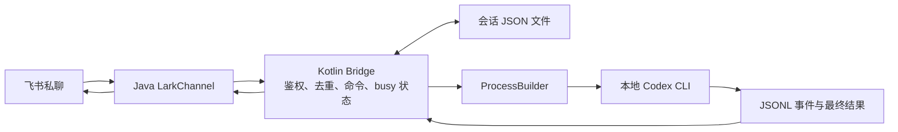

# Kotlin 最小复刻调研

调研日期：2026-09-09。参考仓库：KeepSilenceQP/lark-coding-agent-bridge，固定提交 `c8aa2f4d9b6b3526b172ea407bad76cb208fff3c`，包版本 `0.5.9-qp.9`。

本文区分已核实事实与实施建议；完成了源码、官方文档及 SDK 发布包检查，尚未进行飞书账号连接和 Agent 端到端运行。

## 结论

适合使用 Kotlin/JVM 复刻。建议第一版：单机器人、单个授权用户、私聊文本、固定工作目录、一个 Agent 后端、最终文本回复、会话续接。默认方案以 Codex 为首个后端；如果实际主要使用 Claude Code，可替换适配器而保留其他结构。

最重要的可复用依赖是飞书官方 Java SDK 的 `LarkChannel`。无需自行移植 Node Channel，也无需手写 WebSocket 协议。官方文档列出 `com.larksuite.oapi:oapi-sdk:2.7.3`；本次实际下载 Maven Central JAR，确认包含 `com.lark.oapi.channel.LarkChannel`、`LarkChannelFactory` 和底层 `com.lark.oapi.ws.Client`。

来源：[Java Channel 官方指南](https://github.com/larksuite/oapi-sdk-java/blob/v2_main/CHANNEL.md)、[Maven 发布目录](https://repo.maven.apache.org/maven2/com/larksuite/oapi/oapi-sdk/2.7.3/)。

## 原项目如何工作

它是一个运行在本地的 TypeScript/Node.js 常驻程序：飞书消息进入 Channel，Bridge 做访问控制、会话定位和任务调度，启动本地 Agent CLI，再把结构化输出转成飞书回复。代码生成、工具执行、模型访问和主要对话历史由 Agent 承担。

| 原项目模块 | 作用 | Kotlin 最小版处理 |
| --- | --- | --- |
| `src/bot/channel.ts` | Channel 接入、策略、调度、结果发送 | 拆成 transport 与 orchestrator |
| `src/agent/types.ts` | Agent 运行接口和统一事件 | 保留简化接口 |
| `src/agent/codex/adapter.ts`、`argv.ts`、`jsonl.ts` | 启动 Codex、解析 JSONL、停止、恢复 | 先实现基本协议和生命周期 |
| `src/agent/claude/adapter.ts` | `claude -p`、stream-json、resume | 第二个后端再加 |
| `src/session/store.ts` | 会话 ID、cwd、更新时间落盘 | 一个 JSON 文件即可 |
| `src/bot/scope.ts` | 私聊/普通群按 chatId，话题群按 chatId + threadId | 第一版只按私聊 chatId |
| `src/bot/pending-queue.ts`、`active-runs.ts` | 消息批处理和运行控制 | 先用 busy 拒绝策略 |
| `src/card/*` | 流式卡片、渲染、交互回调 | 延后 |
| `src/project/*`、`src/daemon/*` | 多机器人项目、系统服务 | 延后 |

源码入口：[bot/channel.ts](https://github.com/KeepSilenceQP/lark-coding-agent-bridge/blob/c8aa2f4d9b6b3526b172ea407bad76cb208fff3c/src/bot/channel.ts)、[Agent 接口](https://github.com/KeepSilenceQP/lark-coding-agent-bridge/blob/c8aa2f4d9b6b3526b172ea407bad76cb208fff3c/src/agent/types.ts)、[会话存储](https://github.com/KeepSilenceQP/lark-coding-agent-bridge/blob/c8aa2f4d9b6b3526b172ea407bad76cb208fff3c/src/session/store.ts)、[作用域](https://github.com/KeepSilenceQP/lark-coding-agent-bridge/blob/c8aa2f4d9b6b3526b172ea407bad76cb208fff3c/src/bot/scope.ts)。

这个 fork 还维护机器人注册表、群角色、多机器人交接、Reaction 控制、群提示词、最终回复恢复和延迟重启。它依赖自己维护的 `@larksuite/channel` 打包版本，不能假设 Java Channel 已包含同样的修复。复刻基础链路不需要这些扩展。

来源：[依赖声明](https://github.com/KeepSilenceQP/lark-coding-agent-bridge/blob/c8aa2f4d9b6b3526b172ea407bad76cb208fff3c/package.json)、[项目说明](https://github.com/KeepSilenceQP/lark-coding-agent-bridge/blob/c8aa2f4d9b6b3526b172ea407bad76cb208fff3c/README.md)。

## 推荐结构



技术选择属于建议：Kotlin/JVM + JDK 21、Gradle Kotlin DSL、官方飞书 Java SDK、kotlinx.coroutines、kotlinx.serialization、SLF4J/Logback。单模块命令行应用即可；用 Gradle application 的分发包运行。实现时锁定经过编译验证的依赖组合，2.7.3 是本次核实的 SDK 基线，不表示最新版本。

建议文件边界：

```text
Main.kt                    # 装配、启动、退出清理
BridgeConfig.kt            # 环境变量和路径校验
lark/LarkTransport.kt      # Channel 与内部消息的转换
bridge/BridgeService.kt    # 用户校验、命令、运行状态
agent/AgentRunner.kt       # Agent 接口
agent/CodexRunner.kt       # 子进程和协议
session/JsonSessionStore.kt
```

第一版不需要 Spring Boot、HTTP 服务、数据库或容器。长连接适合本地运行；运行主机需要持续在线并能访问飞书与 Agent 服务。

## 最小范围与验收

| 阶段 | 实现内容 | 验收标准 |
| --- | --- | --- |
| P0：验证连接 | 手动配置应用凭证；只接收授权用户私聊；echo | 飞书发文本，收到对应回复 |
| P1：单轮 Agent | 固定 cwd，启动 Codex，先反馈处理中，再发送最终文本 | 从飞书要求分析本地测试仓库，得到真实结果 |
| P2：可持续使用的 MVP | session 落盘、续接、`/new`、`/status`、`/stop`、超时、busy、错误回执 | 能连续追问、重启续聊、取消任务和开始新会话 |
| P3：逐步增强 | 群聊 @、队列、流式卡片、工作目录切换、Claude、附件 | 按实际使用需求逐项增加 |

P0/P1 是技术跑通，P2 才是建议交付的最小可用版本。流式展示不是第一版验收项。

默认同一会话只运行一个任务；运行中普通消息回复“正在处理，请完成后重试”，不隐式丢弃也不无限排队。`/stop` 和 `/status` 必须绕过运行锁。`/new` 可在空闲时执行；忙时提示先停止，避免复杂的旧结果污染新会话问题。

配置只需 App ID、App Secret、允许的用户 open_id、Agent 可执行路径、workspace、状态目录和超时。凭证从环境变量读取，Agent 子进程环境不应无条件继承飞书密钥。

## 两个外部边界

### 飞书

第一版建议手动准备自建应用并开启机器人，选择长连接事件订阅，配置接收消息事件 `im.message.receive_v1`，开启私聊接收和机器人发送消息所需权限，再发布到测试用户可用范围。原项目的 PersonalAgent 扫码创建/绑定流程可以延后；这是接入方式的简化，不是扫码功能的复刻。

Java Channel 提供 `connect()`、`on("message", ...)`、`send(...)`；回复使用 `replyTo(messageId)`。它已有安全过滤、去重和队列等能力，但需显式配置策略。官方默认的空白名单不限制用户或群，第一版仍应在业务入口强制只接受指定用户的私聊。

长任务不能直接占住 SDK 事件回调。回调完成校验、去重和运行占位后，将执行交给受管理的 coroutine scope；业务层负责运行串行性。不要把 SDK 的回调队列当作已经覆盖整个异步 Agent 生命周期。

权限名称和租户可用性仍需实施时在实际应用后台核验；本次没有修改应用或发送消息。

来源：[官方 Channel 指南](https://github.com/larksuite/oapi-sdk-java/blob/v2_main/CHANNEL.md)。

### Codex

原项目使用子进程而非直接调用模型 API。Kotlin 可沿用此边界：`ProcessBuilder(List<String>)` 传入参数，prompt 写 stdin 并关闭输入，stdout 按 JSONL 读取，stderr 独立消费。

官方确认 `codex exec --json` 支持机器可读事件，`thread.started` 提供 thread_id，`codex exec resume <SESSION_ID>` 用于续接；`--output-last-message` 可以将最终答复写入独立文件。建议每次运行使用独立的临时结果文件，把事件用于会话识别和运行状态，把最终结果文件用于最终回传；实施时验证当前 CLI 的新建与 resume 参数组合。

不要把所有 agent_message 拼接后直接当成最终答案。退出码、终止事件和输出是否为空都要检查；空结果应明确报错，不自动重跑可能已经修改过文件的任务。

会话文件记录 `chatId -> {agent, sessionId, cwd, permissionMode, updatedAt}`。用明确 ID 恢复，不用全局 `--last`。cwd、Agent 或权限配置改变时，新建会话。JSON 写入采用临时文件 + 原子替换；单实例运行，第一版不做崩溃任务自动重放。

初期用 read-only 验证，再在测试仓库启用 workspace-write 并验证文件修改。工作目录本身不等于隔离边界。保留本地 Agent 规则；无需照搬原项目的广泛权限和忽略规则参数。

来源：[Codex 官方非交互模式](https://learn.chatgpt.com/docs/non-interactive-mode)、[原项目参数构建](https://github.com/KeepSilenceQP/lark-coding-agent-bridge/blob/c8aa2f4d9b6b3526b172ea407bad76cb208fff3c/src/agent/codex/argv.ts)、[输出解析](https://github.com/KeepSilenceQP/lark-coding-agent-bridge/blob/c8aa2f4d9b6b3526b172ea407bad76cb208fff3c/src/agent/codex/jsonl.ts)。

## 需要保留的基本可靠性

- **重复事件**：按 messageId 去重；先使用 SDK 去重并验证重复事件只启动一次。内存去重不提供重启后的 exactly-once 保证。
- **管道阻塞**：并行消费 stdout/stderr；协程取消不等于 OS 进程结束。
- **停止/超时**：终止 Agent 及其子进程，等待退出，释放 busy；第一版以 macOS/Linux 为目标，进程树清理需要实际测试。
- **超长回复**：优先纯文本并使用 SDK 分片，检查发送结果。Agent 成功和消息送达是两个状态；发送失败可保留结果重试发送，但不能重新执行 Agent。
- **会话串线**：按 chatId 绑定明确 sessionId。恢复失败明确反馈，避免无提示切换到全新上下文。
- **协议变化**：未知 JSONL 事件可记录并跳过，必要终态缺失则失败；不要因为新事件类型使整个解析器崩溃。

建议自动化验证：fake Agent 模拟大量 stderr、异常退出、无终态、超时与取消；会话 ID 续接和重置；重复消息与 busy 竞争。真实验收只需先覆盖 echo、仓库分析、连续追问、重启续接、停止和测试仓库写文件。

## 工期判断与待确认点

按熟悉 Kotlin 的单人投入估计：P0/P1 约 1–2 个开发日，P2 再约 2–3 日。属于范围估算，不包含应用审批等待、网络问题和 CLI 版本兼容排查。

开始实现前只需要确认首个 Agent 是 Codex 还是 Claude Code、可用的飞书应用、测试 workspace。建议默认 Codex + 私聊 + 本机前台运行。当前工作目录尚无实现文件，本次仅新增调研文档。
